# Pipeline services & frameworks — breakdown and evaluation

## Context

You asked for an audit of the stack used across the capture → annotate → fuse → generate → view pipeline, not an implementation. This document walks each stage, names the exact libraries/services at each hop, cites the file that owns that concern, and evaluates fit (strengths, risks, alternatives worth knowing about). It also flags doc drift in `ARCHITECTURE.md` that misrepresents the current codebase.

## Pipeline shape

```mermaid
flowchart LR
  A[iPad Safari<br/>capture/page.tsx] -- File + capture=environment --> B[resizeImage<br/>OffscreenCanvas JPEG q=0.85]
  B -- FormData --> C[POST /api/upload<br/>Supabase service client]
  C -- originals/ bucket + sessions row --> D[annotate/&lsqb;sessionId&rsqb;<br/>AnnotationCanvas.tsx]
  D -- perfect-freehand + SVG overlay --> E[flattenCanvasToBlob<br/>Canvas2D + serialized SVG + sticker PNGs]
  E -- FormData: image + strokes + notes --> F[POST /api/generate]
  F -- returns genId immediately --> G[after&lpar;&rpar; from next/server]
  G --> H[Claude Haiku 4.5<br/>prompt-fusion.ts<br/>ephemeral cache on system block]
  H -- finalPrompt --> I[Gemini 2.5 Flash Image<br/>image-pipeline.ts<br/>generateContent + inlineData]
  I -- base64 image bytes --> J[Supabase Storage results/ + generations.complete]
  K[processing page polls 2s] --> L[GET /api/job/&lsqb;genId&rsqb;]
  L --> M[result page<br/>react-compare-slider]
```

## Stage-by-stage

### 1. Capture — `src/app/capture/page.tsx`, `src/lib/image-utils.ts`

| Concern | Tech | Evaluation |
|---|---|---|
| Camera access | `<input type="file" accept="image/*" capture="environment">` | Correct choice for iPad Safari — `getUserMedia` is flaky there, per AGENTS.md gotcha. No alternative worth considering for v1. |
| Client resize | `createImageBitmap` + `OffscreenCanvas` → JPEG q=0.85, maxEdge 2048 | Lean, no deps. `OffscreenCanvas` is fine on iPadOS 16+. Keeps raw 5–10MB iPad photos off the wire. |
| Upload transport | `FormData` → `fetch` | Standard; no multipart library needed. |

Risks: no retry on upload failure (surface-level `setError`); no progress indicator for slow connections.

### 2. Upload — `src/app/api/upload/route.ts`

| Concern | Tech | Evaluation |
|---|---|---|
| Runtime | Next.js 16 route handler | Dynamic by default (correct for POST). |
| DB + object store | `@supabase/supabase-js` service-role client (`src/lib/supabase.ts`) | Single vendor covers both needs — reasonable for demo scale. Service key gated server-side. |
| Bucket | `originals/{sessionId}/photo.jpg` (public-read) | Public URLs are guessable — fine for demo, bad for real clients' yards. |

### 3. Annotate — `src/components/AnnotationCanvas.tsx`, `Toolbar.tsx`, `NotesPanel.tsx`

| Concern | Tech | Evaluation |
|---|---|---|
| Drawing engine | `perfect-freehand` v1.2 → SVG paths | Pressure-style smoothing without a full canvas lib; ~3kB gzipped. Good fit for a single-tool app. |
| Rendering | SVG overlay positioned to exact image bounds via `updateRenderedRect()` | Resolution-independent; strokes stored as 0–1 ratios (`types.ts`), so rehydration survives device/rotation changes. Strong design. |
| Stickers | Preloaded `` refs + SVG `<image href>` | Necessary for sticker aspect-ratio math during flatten. Fine. |
| State | React 19 `useState` + a `redoHistory` stack | Simple. Not great if undo/redo grows to include sticker-size edits, but current semantics are append-only so it holds. |
| Styling | Tailwind v4 `@theme inline` tokens in `globals.css` | No JS config — matches Next 16 conventions. Tool colors defined both in CSS tokens and hardcoded in `TOOL_COLORS` constant; duplication is a minor smell. |

Risks: canvas pan/zoom is explicitly not supported (gesture vs. drawing conflict on mobile Safari). Tool list is duplicated across five files (`types.ts`, `Toolbar.tsx`, `AnnotationCanvas.tsx`, `master-prompt.ts`, `api/generate/route.ts` `countStrokes`); drift here silently degrades Gemini output.

### 4. Flatten — `src/lib/image-utils.ts` `flattenCanvasToBlob`

| Concern | Tech | Evaluation |
|---|---|---|
| Compositor | HTML `<canvas>` 2D, two-pass (SVG without stickers, then stickers as direct draws) | Two-pass is deliberate — inline `<image href>` in SVG breaks when serialized then rasterized. Pragmatic workaround. |
| Output | JPEG q=0.82, maxEdge 1536 | Smaller than upload original (2048) — sensible to shrink before Gemini since model tolerates 1536px fine. |

Risks: 4MB client-side size guard is a hard throw — dense annotations on big photos can blow past it. No fallback retry with smaller `maxEdge`.

### 5. Orchestrate — `src/app/api/generate/route.ts`

| Concern | Tech | Evaluation |
|---|---|---|
| Async pattern | `after()` from `next/server` | Correct choice in Next 16 — replaces manual `waitUntil` wiring; on Vercel it delegates automatically. **Needs Vercel Pro** (60s function limit); Hobby's 10s cap would kill ~15–20s pipelines. |
| Status machine | `pending → processing → complete / failed` in `generations` row | Adequate. No retry logic despite `attempts` column — always set to 1. |
| Error class | `GeminiRefusalError` distinct from generic `Error` | Good: lets UI show "try a different photo" copy vs generic failure. |

Risks: `after()` runs after the HTTP response — if it throws *before* writing the failure row (e.g., Supabase outage), the client polls a row stuck in `processing` forever. No timeout/heartbeat.

### 6. Prompt fusion — `src/lib/prompt-fusion.ts`, `src/lib/prompts/master-prompt.ts`, `src/lib/anthropic.ts`

| Concern | Tech | Evaluation |
|---|---|---|
| SDK | `@anthropic-ai/sdk` v0.88 | Current major. |
| Model | Claude Haiku 4.5 (`claude-haiku-4-5-20251001`) via `PROMPT_FUSION_MODEL` constant | Right size — this is a short structured-output task. Haiku is cheap and ~1s typical. |
| Caching | `system: [{ type: 'text', text: MASTER_PROMPT, cache_control: { type: 'ephemeral' } }]` | 5-min ephemeral cache. Master prompt is ~1.5k tokens, so hit rate matters for cost; it only triggers for 2nd+ generations within 5 minutes — probably rare for this installer flow (one generation per site visit). Consider whether caching earns its complexity here. |
| Output contract | JSON `{ finalPrompt, reasoning }` via "respond with ONLY a JSON object" instruction; `JSON.parse` with raw-text fallback | Works, but fragile — no Anthropic `response_format` / tool-use for structured output. A single prose-prefixed response flips to the fallback branch silently. Swapping to tool-use would harden this. |

### 7. Image generation — `src/lib/image-pipeline.ts`, `src/lib/gemini.ts`

| Concern | Tech | Evaluation |
|---|---|---|
| SDK | `@google/genai` v1.50 | Current. |
| Model | `GEMINI_IMAGE_MODEL` env var (pinned string, e.g. `gemini-3-pro-image-preview` per AGENTS.md) | Pinning is correct — image models churn. Upgrade path is clean (swap env var, validate). |
| Transport | `generateContent` with multimodal parts (`text` + `inlineData` base64) | Single HTTP call, no polling — simpler than async image APIs (e.g., older Imagen, OpenAI batch). |
| Safety | `promptFeedback.blockReason` + `finishReason === "SAFETY"` → `GeminiRefusalError` | Covers both pre-block and post-generation refusals. Good. |
| Cost | ~$0.039/gen per AGENTS.md | Real money given no auth / rate limit. |

Risks: `sniffImageMimeType` only detects PNG vs JPEG — no HEIC/WebP. Fine since the flatten step produces JPEG, but a hand-crafted request could surprise it.

### 8. Result delivery — `src/app/api/job/[genId]/route.ts`, `src/app/processing/.../page.tsx`, `src/components/ResultView.tsx`

| Concern | Tech | Evaluation |
|---|---|---|
| Polling | Client `setTimeout(poll, 2000)` loop in processing page | Simple; 2s is reasonable for a 15–20s job. No SSE/WebSocket — not worth the complexity for this app. |
| Status route | `RouteContext<'/api/job/[genId]'>` generated type, `await ctx.params` | Uses Next 16 idioms correctly. |
| Before/after view | `react-compare-slider` v4 | Mature, tiny, touch-friendly. Correct pick. |

### Cross-cutting concerns

- **Auth / rate limiting:** neither exists. Public URL + ~$0.039/gen Gemini cost is the single biggest production risk. AGENTS.md already flags it.
- **RLS:** enabled on both tables with zero policies; service key bypasses, anon gets nothing. Correct posture for server-only writes.
- **Env handling:** lazy loader in `src/lib/config.ts`; `/api/health` reports service readiness. Good separation from Next typegen.
- **Observability:** `fusion_log` column captures Claude's reasoning + fused prompt — this is the only debug trail. No request IDs, no structured logs. Adequate for demo.
- **Tool list duplication:** five-file fan-out (`types.ts`, `Toolbar.tsx`, `AnnotationCanvas.tsx`, `master-prompt.ts`, both `generate`/`regenerate` `countStrokes`). The main real risk to output quality — drift here is silent.

### Doc drift spotted

`ARCHITECTURE.md` is out of sync with the code. Worth knowing before you trust it:

- Tool table lists old 3-tool set (`pathway / roofline / accent`). Code is the 5-tool set (`deck`, `permanent`, `downlight`, `uplight`, `pathlight`) per `src/lib/types.ts` and `master-prompt.ts`. AGENTS.md's "Branch note" acknowledges this was an experiment merged into main.
- Storage layout says `annotated/{sessionId}/{genId}.png`. Code uploads `.jpg` with `image/jpeg` content type (`api/generate/route.ts:44, 50-53`).
- `StrokeCounts` shape in ARCHITECTURE.md (`{ pathway, roofline, accent }`) does not match current `countStrokes` output (`{ deck, permanent, downlight, uplight, pathlight }`).

## Verification — how to sanity-check this audit

1. `npm run dev` and hit `/api/health` — confirms Supabase/Anthropic/Gemini are all wired.
2. `grep -n "tool === " src/` — enumerates every place the tool enum is branched on; verifies the five-file fan-out claim.
3. Open Supabase Table Editor → `generations` → inspect `fusion_log` for a completed row. Confirms the two-stage fusion (reasoning + finalPrompt) actually runs.
4. Read `node_modules/next/dist/docs/01-app/03-api-reference/04-functions/after.md` — verifies the `after()` semantics and Vercel tier implication called out in §5.
5. `rg -n "png|jpg|jpeg" src/app/api/generate/route.ts supabase/migrations` — confirms the JPEG-vs-PNG drift flagged under "Doc drift."

No code changes are proposed by this plan. If you want, the follow-up could be (a) fixing `ARCHITECTURE.md` drift, (b) consolidating the tool enum into a single source of truth, or (c) adding an IP-based rate limit on `/api/generate`. Those would be separate plans.
